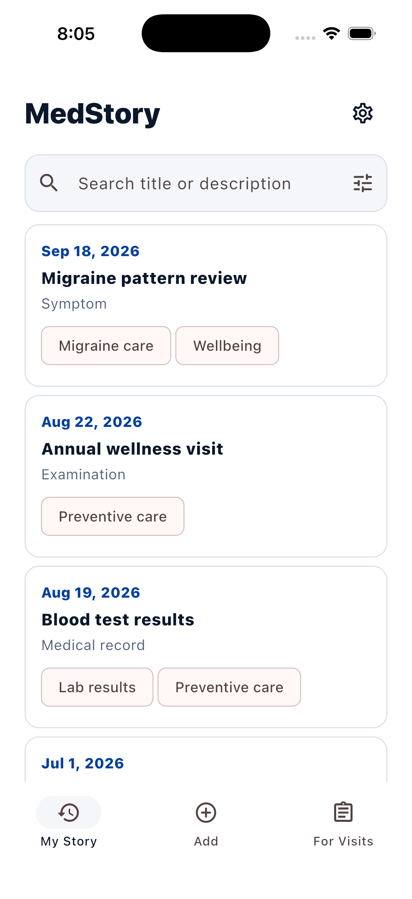
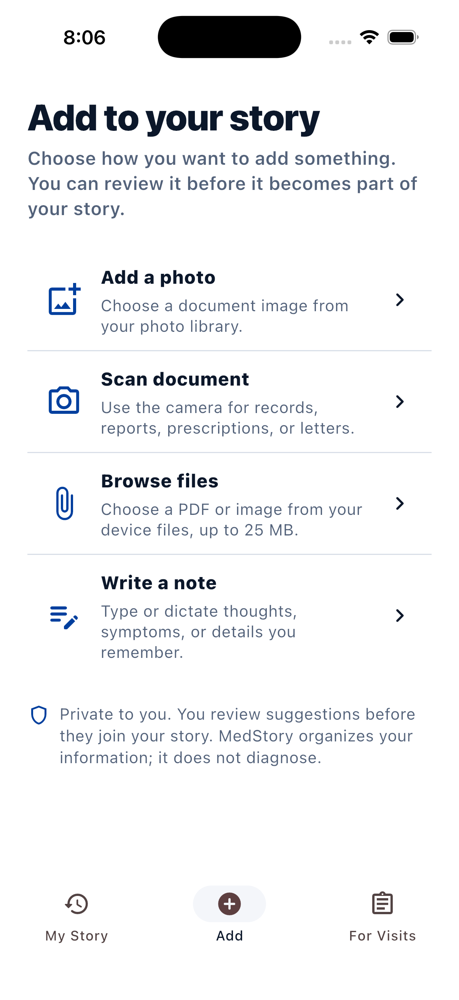
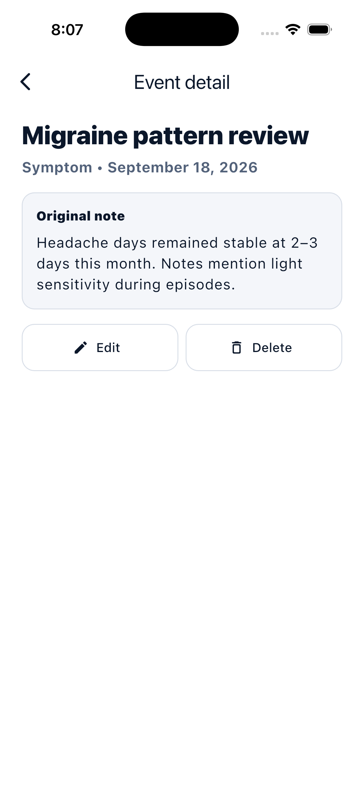
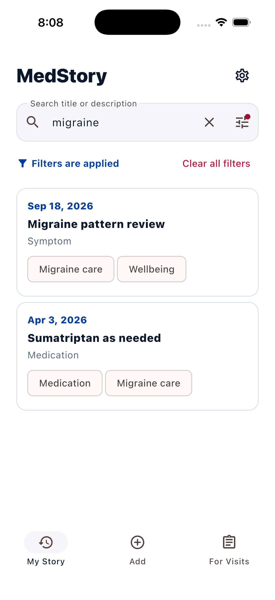
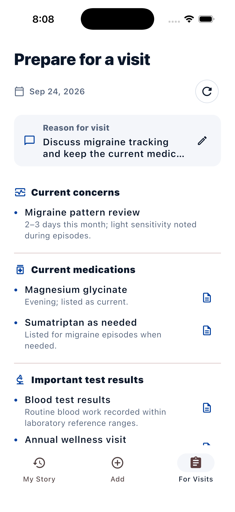

# MedStory

**Your medical history. Less searching. More perspective.**

A lab result in a patient portal. A prescription on paper. A symptom you meant to mention. Keeping track of your health often means piecing together information scattered across folders, photos, and memory.

MedStory brings those pieces into a searchable personal medical history, with AI helping turn documents and everyday notes into organized records.

<table>
  <tr>
    <td width="55%" valign="middle">
      <h3>Remember the whole story</h3>
      
Keep symptoms, test results, medications, and care history together in a chronological timeline.

      
Find a past record when you need it. Look back at what happened, when it happened, and what you recorded afterward—without reconstructing everything from memory.

      
Built for people managing an ongoing condition, a long medical history, or simply a growing pile of records.

    </td>
    <td align="center">
      
    </td>
  </tr>
</table>

## Capture once. Find it later.

Scan a paper record, choose photos, or upload a PDF. AI reads the content and organizes it into a dated medical record. Prefer words? Type a quick note or speak, edit the transcription, and let AI structure the details.

Open the result to inspect the AI analysis, make corrections, and return to the original document. Your source material stays connected to your story.

<table>
  <tr>
    <th>Start with what you already have</th>
    <th>Keep the context behind every record</th>
  </tr>
  <tr>
    <td align="center"></td>
    <td align="center"></td>
  </tr>
</table>

## Make your history useful

Search your records by keyword and narrow the timeline by year or record type. Keep track of symptoms and changes over time, then prepare for a visit with a concise summary linked to the records behind it. Add your reason for the visit to help prioritize the briefing.

<table>
  <tr>
    <th>Find related records with a search</th>
    <th>Arrive with your story in order</th>
  </tr>
  <tr>
    <td align="center"></td>
    <td align="center"></td>
  </tr>
</table>

*Real app screenshots using demo data. Available in English and Russian.*

MedStory organizes and explains recorded information; it does not diagnose conditions or recommend treatment. AI output can be inspected and edited. Private originals are encrypted on the server, access is scoped to your account, and account deletion is available in settings.

## Behind the product

Built by **Alibek Kapan**, MedStory combines a Flutter client with Riverpod and Drift, a Django REST API, PostgreSQL, and Celery background processing. Engineering focuses on validated AI output, source traceability, user isolation, and interchangeable OCR, language-model, and speech-to-text providers.

The core experience is implemented; production launch checks remain in progress. Explore the [architecture](docs/technical-architecture.md), [AI pipeline](docs/ai-pipeline.md), [privacy design](docs/security-privacy.md), and [roadmap](docs/mvp-roadmap.md). For local development, start with the [backend workflow](backend/workflow.md) and [frontend guide](docs/frontend-architecture.md).

## License

Copyright © 2026 Alibek Kapan. **Source-available under the [PolyForm Noncommercial License 1.0.0](LICENSE).** Noncommercial use, modification, and redistribution are permitted subject to its terms. Commercial use requires separate permission.
